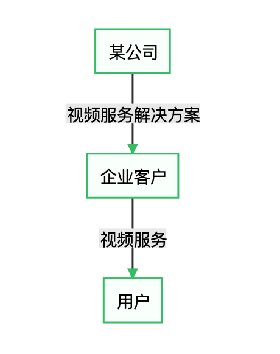

# 第一章：何谓B端产品

B端产品或者说“2B”产品的定义大多是围绕2B和2C的区别来进行探讨的。

《人人都是产品经理》的作者苏杰是这么来探讨这个问题的：

[https://zhuanlan.zhihu.com/p/21102672](https://zhuanlan.zhihu.com/p/21102672)

文字中除了最后男人女人的比喻实在太扯之外，其他说的还算比较准确的。

B端产品是一个很宽泛的定义。只要是To Business就划入了B端产品的范畴。

## 1-B端产品定义

我为B端产品做如下定义：为组织提供商业价值的产品。

### 1.1-组织

B端产品的用户是组织，或者说使用产品的过程中，其最终用户承担组织中的职责。组织包括：

1. 商业公司
2. 政府单位
3. 非赢利机构等

但凡是若干个人或群体组成，有共同目标与边界的社会实体都称为组织。

### 1.2-商业价值

B端产品的最终目的是通过一系列的服务（注意这里不仅仅是软件，软件只是服务之一）为组织输出商业价值。

组织也是基于可能获得的商业价值来进行购买决策的。

### 1.3-举例

某公司推出企业视频服务，其企业客户可以采购该公司推出的解决方案，通过视频的方式向自己的用户开展服务。

该公司的产品线分为两条，一条是企业的“视频运营管理平台”，另一条是用户的“视频客户端”。

视频运营管理平台 -&gt;&gt; B端产品 视频客户端 -&gt;&gt; C端产品

很多产品经理会将视频客户端也认为是B端产品，理由如下：

1. 公司是做B端业务的
2. 公司的客户都是企业
3. 视频客户端需要有企业客户的参与才能真正使用

这是我遇到的一个实例，后来我跟这位产品同学解释，淘宝是C端产品，淘宝商家客户端和淘宝极其复杂的运营后台是B端产品，你这个情况跟淘宝很类似。

## 2-B端产品的分类

对B端产品进行分类的原因在于，产品设计的过程中不同类型的B端产品，其决策的出发点不同，版本规划的优先级、功能设计的方式，甚至对产品经理能力的依赖都是有所区别的。分类能帮助大家更清晰地进行分析与决策。

B端产品可以分为以下几类：

1. 工具类
2. 支撑类
3. 协同类
4. 组织运营管理类

分类的依据如下：

1. 产品的价值不同
2. 最终用户在组织中的角色不同

> 价值：B端产品最关键的地方就在于价值，价值是产品决策中核心的判断依据

### 2.1-工具类B端产品

工具类产品核心价值是提高效率。除此之外，工具类产品还有以下几个特点：

1. 面向特定的领域
2. 面向特定的应用场景
3. 在特定的环境中进行使用
4. 其最终用户为单个或少数的几个岗位
5. 通过该工具类产品的使用，实现某个特定的要求，或者达到工作效率提升的目的

工具类产品的数量及其庞大，在企业的运营管理中，需要通过软件，甚至硬件软件结合的方式来提高效率的需求极其旺盛，并且随着工业互联网的发展，随着信息化的发展，工具类的B端产品数量会愈发庞大。

很多企业都会根据自己的实际需要，自行进行工具类产品的开发，有时也会采购一些适用性较高的产品，然后根据自己的实际需要进行一定程度的定制。

工具类B端产品，从需求的收集开始，再到产品设计、研发实现、部署实施、交付试点，最后是培训维保，最后在购买方持续的使用中不断发挥价值。

举例：

* 信息安全产品：信息安全行业的产品，大多属于工具类产品
* 生产控制类产品：一些生产领域，需要对生产环节进行控制
* 虚拟化产品
* 图像标注工具：现在很火的一类产品，用于训练AI
* 舆情管理产品：这个不多说了
* 等

### 2.2-支撑类B端产品

我是这样界定支持类的B端产品，企业单独购买支撑类产品不会实现任何价值，但是支撑产品对于企业的业务起到了重要的支撑作用。

这类支撑类的产品有的是极其复杂的，企业自己生产代价很高，如云服务等；还有的是该品类产品相对成熟，无须自己建设，比如代码托管等。

这类产品需要非常关注其与所支持业务的关系。

举例：

* 云服务
* 身份管理产品：如AD或者LDAP等身份管理产品
* 代码托管产品：比如git，SVN等
* 信息推送产品：如个推、短信推送等
* 反作弊类产品：如图片验证码等
* 等

### 2.3-协同类B端产品

协同类产品有如下特点：

1. 单独用户使用没有意义
2. 参与者往往跨多个岗位
3. 降低沟通协作的成本
4. 规范协作的流程

企业的业务和管理难免需要沟通和流程。

流程看似是非常简单的事情，然而合理流程的制定，却是极其考验能力的。流程的设计需要兼顾管理过程中的可用性、效率、易用性等。

举例：

* OA类产品
* 企业通讯类产品：Slack、蓝信、微信企业版、钉钉等
* 会议通讯类产品：zoom等
* 等

### 2.4-组织运营管理类B端产品

企业的组织管理是企业赖以生存的核心。

> 华为的强大就是在于其强大的组织管理能力。

组织管理的内容包括企业的方方面面。当代社会信息化已经深入企业的管理的方方面面，因此组织管理类的工具也在随着技术的发展逐渐进步。数字化、信息化正在不断改造企业的管理。

核心业务的运营，更是需要一套与业务匹配的运营管理后台。哪怕组织的业务再简单不过，只是运营一个小程序，或是说只是电话销售公司维护自己的顾客清单，也需要一个可供日常运营管理操作的软件系统，该系统支撑业务的正常运转。

组织运营管理类B端产品的特点如下：

1. 应用场景多，定制程度高：一些该类B端产品的应用场景贯穿了组织运营管理的始终
2. 复杂，由于涉及到组织管理，那么令人眼花缭乱的逻辑关系、业务关系、操作流程、审计制度就会贯穿产品的始终
3. 用户的角色多，与协作类产品：每个角色的操作都是流程上的一个节点所不同，不同用户岗位在系统中角色不同，其权限、对应功能差异明显
4. 往往涉及到与其他系统或产品的对接与协同
5. 配合管理的制度与流程使用产品，组织管理和业务管理中，都需要有流程和制度，产品的设计、使用也必须符合其流程制度，这也是运营管理类产品定制程度往往较高的原因之一。

举例

* ERP系统
* EOM系统
* CRM系统
* 财务系统
* 人力资源管理系统
* 等

> 也有人会将面向管理和面向运营的B端产品再分成两类来看待。这样区分也有一定的道理，一个是面对组织内部的，管理的是组织内部的资源；一个是面对组织外部的，管理的是组织对外的业务。 我这里并没有采用这样区分的原因是，实际中内部和外部的边界有时候会很薄弱，设计外部业务的管理产品时，往往需要考虑到内部的资源问题，而设计内部管理的产品时，也要兼顾到外部业务的支持问题。 而且，一些产品往往会横跨这两个分类，尤其是在一些组织的初创时期，内部管理还比较简单，而外部业务至关重要，这时候“纵向”的一体化管理成为组织在特定时期的建设系统的诉求。

